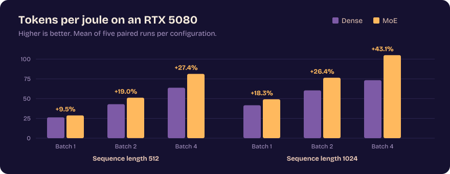

  

  
  
  
  

 

I like turning a vague "wouldn't it be nice if…" into something that actually runs. Lately that means a real-time social platform written in **Go** and **Svelte**, local LLM services built with a team for **Beijer Electronics**, and a steady stream of smaller apps in whatever stack fits the problem: React, .NET, Flutter or plain C.

Most of my work lives in private repos, so here's a tour instead.

 

## 🔭 What I'm building now

### Counterpart

A real-time social platform for web and desktop, with friends and presence, voice rooms with end-to-end encryption, MFA and account security, file uploads to Cloudflare R2, and an admin panel for moderation. Built solo, 100+ commits and counting.

It's designed to serve 10,000–50,000 users on a single machine, and the architecture lets it grow both vertically and horizontally from there. Currently in testing ahead of launch.

  

  
  
  
  
  
  
  
  
  
  
  

 

## 📄 Research

### Dense vs. Mixture-of-Experts transformers on consumer hardware

*Bachelor's thesis, Malmö University, 2026, with [@AdamMheisen](https://github.com/AdamMheisen)*
<!-- When the thesis is published, I'll link it here, like in [Read the thesis](https://...) -->

Do MoE models actually save energy outside the datacenter? We trained two ~1B-parameter language models from scratch on 10B tokens using JAX/Flax on a Cloud TPU v4-32: a dense transformer and a Switch-style MoE with 8 experts and top-1 routing, matched to within 0.03% in parameter count. We then benchmarked inference on a single RTX 5080, measuring GPU power through NVML across a grid of batch sizes and sequence lengths.

The MoE model was more energy efficient in all 30 paired runs: up to **43% more tokens per joule** and **21% less GPU energy** over the full workload, while also running faster. The catch is quality. At this training budget, the dense model reached clearly better perplexity and accuracy, so the result is a real efficiency–quality trade-off rather than a free lunch.

  

  
  
  
  
  

 

## 🧩 Selected projects

<table>
  <tr>
    <td width="50%" valign="top">
      <h3>LLM services for Beijer Electronics</h3>
      
Commissioned student project in a team of five: an MCP server and insight backend that let Beijer's platforms use locally hosted LLMs, with GPU and CPU inference, a simulator and Dockerised deployment.

      
      
      
      
      
    </td>
    <td width="50%" valign="top">
      <h3><a href="https://g7studytracky.netlify.app">StudyTracky</a></h3>
      
A Pomodoro study app built with two classmates. Run focus sessions, add courses, see charts of how much you've studied and generate a quick AI quiz on what you just read. Everything stays in the browser, no account needed.

      
      
      
      
    </td>
  </tr>
  <tr>
    <td width="50%" valign="top">
      <h3>GameVault</h3>
      
A Flutter app for keeping lists of every game you care about, with progress, ownership, prices and release dates in one place.

      
      
    </td>
    <td width="50%" valign="top">
      <h3>Healy</h3>
      
A rehab companion that helps patients and people who train follow their exercises, and gives physiotherapists a way to guide their patients.

      
      
      
    </td>
  </tr>
  <tr>
    <td width="50%" valign="top">
      <h3>MazeGen</h3>
      
A maze generator and level editor our team of seven took over from a previous group and kept building on across sprints: custom levels you can create, play and test, a JUnit 5 test suite with Allure reports, and CI that runs the tests on every push.

      
      
      
      
    </td>
    <td width="50%" valign="top">
      <h3>YourAssistant</h3>
      
A scheduling web assistant built in a team of four, with a Java backend that scrapes and matches data, user login over HTTPS and a containerised deployment with Docker.

      
      
      
      
    </td>
  </tr>
</table>

  
<b>Smaller builds from my .NET coursework</b>

   

  | Project | What it is | Stack |
  |---|---|---|
  | **BudgetMaster** | A personal-finance app that's nicer to look at than WinForms has any right to be | C#, Windows Forms |
  | **Taskmanager** | A to-do manager with file save/load and menus | C#, Windows Forms |
  | **PortfolioX** | A portfolio web app | ASP.NET, C#, HTML/CSS |
  | **Language Learner** | A cross-platform vocabulary app using MVVM | .NET MAUI, XAML |

 

## 🛠️ Toolbox

**Languages**
 

**Frontend & mobile**
 

**Backend & data**
 

**Tools**
 

Also worked with: Verilog/HDL, Assembly, Vaadin, .NET MAUI, Windows Forms, WPF and llama.cpp.

 

## 📈 Activity

<picture>
  <source media="(prefers-color-scheme: dark)" srcset="https://raw.githubusercontent.com/OneAndOnlyWahidHassani/OneAndOnlyWahidHassani/output/snake-dark.svg" />
  <source media="(prefers-color-scheme: light)" srcset="https://raw.githubusercontent.com/OneAndOnlyWahidHassani/OneAndOnlyWahidHassani/output/snake-light.svg" />
  
</picture>

 

## 🎲 Off the keyboard

Hiking around Skåne, gaming, reading, going far too deep into Warhammer 40K lore, and learning whatever caught my attention this week.

 

  Always up for talking about side projects, LLM tooling or a good build. Say hej!

